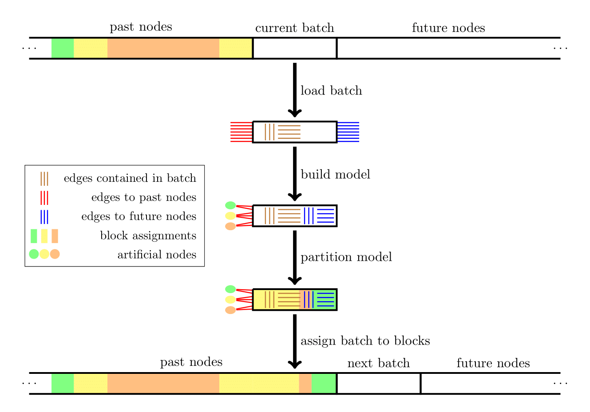
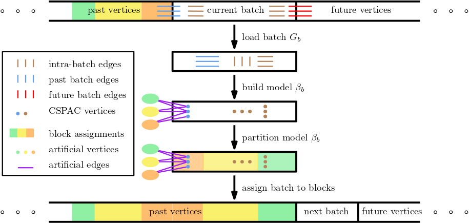

# HeiStream & HeiStreamE
[](https://app.codacy.com/gh/KaHIP/HeiStream/dashboard?utm_source=gh&utm_medium=referral&utm_content=&utm_campaign=Badge_grade)
[](https://opensource.org/licenses/MIT)

HeiStream is a buffered streaming algorithm to heuristically solve the graph partitioning problem: dividing the nodes of a graph into k disjoint blocks of roughly the same size while minimizing the number of edges running between blocks.
HeiStream is a first attempt to close a gap observed in the space of available partitioning algorithms. 
On the one hand, there are streaming algorithms that have been adopted to partition massive graph data on small machines. 
In the streaming model, vertices arrive one at a time including their neighborhood and then have to be assigned directly to a block. 
These algorithms can partition huge graphs quickly with little memory, but they produce partitions with low solution quality. 
On the other hand, there are offline (shared-memory) multilevel algorithms that produce partitions with high quality but also need a machine with enough
memory to partition huge networks. 
HeiStream uses a buffered streaming computational model and a multilevel algorithm, which allows it to compute significantly improved partitions of huge graphs using a single machine with little memory.

<p align="center">

</p>

The image above illustrates the overall structure of HeiStream. 
It slides through the streamed graph G by repeating the following successive operations until all the nodes of G are assigned to blocks. 
First, it loads a batch containing the desired number of nodes alongside with their adjacency lists. 
Second, it builds a model B to be partitined. 
This model represents the already partitioned vertices as well as the nodes of the current batch. 
Third, it partitions B with a multilevel partitioning algorithm to optimize for the Fennel objective function. 
Finally, it permanently assigns the nodes from the current batch to blocks. 

### HeiStreamE

HeiStreamE extends HeiStream to solve the edge partitioning problem, dividing the edges of a graph into k disjoint blocks while minimizing vertex replicas.

<p align="center">
  
</p>

We slide through the input graph G by iteratively performing the following series of operations until all the edges of G are assigned to blocks.
First, we load a batch composed of δ vertices and their associated adjacency lists, thereby obtaining a subgraph G_b contained within the graph G.
This operation yields edges connecting vertices within the current batch, and edges connecting vertices in the current batch to vertices streamed in previous batches.
Second, we build a model β_b corresponding to G_b, where the edges of G_b are transformed into vertices. Additionally, we incorporate a representation of block assignments
from previous batches into β_b.
Third, we partition β_b using a multilevel vertex partitioning algorithm.
We conclude by permanently assigning the edges in G that correspond to vertices in our model β_b to their respective blocks.

Our experiments demonstrate that HeiStreamE produces the best solution quality (replication factor) among all known (re)streaming edge partitioners and is highly memory efficient.

## Installation Notes

### Requirements

* C++-14 ready compiler 
* CMake 
* Scons (http://www.scons.org/)
* Argtable (http://argtable.sourceforge.net/)

### Building HeiStream & HeiStreamE

To build the software, run
```shell
./compile.sh
```

Alternatively, you can use the standard CMake build process.

The resulting binary is located in `deploy/heistream` and `deploy/heistream_edge`.

## Running HeiStream

To partition a graph in METIS format using the basic model of HeiStream, run

```shell
./heistream <graph filename> --k=<number of blocks> --stream_buffer=<nodes per bufer>
```

To partition a graph in METIS format using the extended model of HeiStream, run

```shell
./heistream <graph filename> --k=<number of blocks> --stream_buffer=<nodes per bufer> --stream_allow_ghostnodes
```

For a complete list of parameters alongside with descriptions, run:

```shell
./heistream --help
```

For a description of the graph format, please have a look at the [KaHiP manual](https://github.com/KaHIP/KaHIP/raw/master/manual/kahip.pdf).

## Edge Balancing

HeiStream was not designed to balance edges, but we have implemented a temporary solution to allow this. 
If you want to balance edges instead of nodes, you can enable the --balance_edges flag within your command for executing HeiStream.

## Running HeiStreamE

To partition a graph in the METIS format using HeiStreamE, run

```shell
./deploy/heistream_edge <graph filename> -k=<number of blocks> --stream_buffer=<δ vertices per buffer>
```
By default, this command creates and writes a vector of partition IDs for all edges of size _m_ to a text file.

To avoid the creation of this vector, use the flag `--stream_output_progress`. This writes the partition IDs assigned to edges
within each batch on the fly.

To only benchmark the algorithm for runtime and memory consumption, use the flag `--benchmark`. With this command,
partition IDs are not written to a file.

It is possible to pass both the flags `--stream_output_progress` and `--benchmark`. In this case, you will need to use our
evaluator to obtain the partition statistics. The evaluator can simply be called, after executing the
corresponding `./heistream_edge` command, as follows:

```shell
./deploy/evaluate_edge_partition <graph filename> -k=<number of blocks> --stream_buffer=<nodes per buffer>
```

You may also use a light version of the in-built evaluator for partition results,
which is more efficient when the graph is very large and cannot easily fit into memory using the flag `--light_evaluator`.

Additionally, you have the option to specify the name of the file to which partition IDs will be written with the flag `--output_filename=<name>`.
By default, the output file is called `tmp_output.txt`.

For example, to test the provided graph(s) in `examples/`, you can use the following commands:
```shell
./deploy/heistream_edge examples/com-amazon.graph --k=32 --stream_buffer=32768
```
```shell
./deploy/heistream_edge examples/com-amazon.graph --k=4 --stream_buffer=16384 --stream_output_progress
```
```shell
./deploy/heistream_edge examples/com-amazon.graph --k=16 --stream_buffer=131072 --stream_output_progress --benchmark --output_filename=com-amazon_16_16384_part.txt
./deploy/evaluate_edge_partition examples/com-amazon.graph --k=16 --stream_buffer=131072 --output_filename=com-amazon_16_16384_part.txt
```

For a complete list of parameters alongside with descriptions, run:

```shell
./deploy/heistream_edge --help
```

## Licensing

HeiStream and HeiStreamE are free software provided under the MIT License.
If you publish results using our algorithms, please acknowledge our work by citing the following paper ([pdf](https://dl.acm.org/doi/10.1145/3546911)):

```
@article{heistream,
	author = {Marcelo Fonseca Faraj and Christian Schulz},
	title = {Buffered Streaming Graph Partitioning},
	year = {2022},
	publisher = {Association for Computing Machinery},
	address = {New York, NY, USA},
	issn = {1084-6654},
	url = {https://doi.org/10.1145/3546911},
	doi = {10.1145/3546911},
	journal = {ACM Journal of Experimental Algorithmics},
	month = {jun},
	keywords = {streaming algorithms, multilevel algorithms, graph partitioning}
}
```

Note:
- The program stores the results of the executed command in a [flatbuffer](https://github.com/google/flatbuffers) `.bin`
  file identified by `graph_k_stream_buffer.bin` if you pass the flag `write_log`.
- To partition graphs in HeiStreamE with 64 bit vertex IDs, edit the CMakeLists.txt file to change `Line 73: option(64BITVERTEX "64 bit vertex" OFF)` to
  `Line 73: option(64BITVERTEX "64 bit vertex" ON)`, and then run `./compile.sh`.
- For a description of the METIS graph format, please have a look at the [KaHiP manual](https://github.com/KaHIP/KaHIP/raw/master/manual/kahip.pdf).
- The binary equivalents of the METIS graphs were obtained by using the converter provided in
  [KaGen](https://github.com/KarlsruheGraphGeneration/KaGen) with `output-format=parhip`.
- The provided code for HeiStreamE consists of the baseline configuration updated after tuning experiments. In particular, it uses the minimal model mode
  and the batch alpha Fennel scoring parameter.

