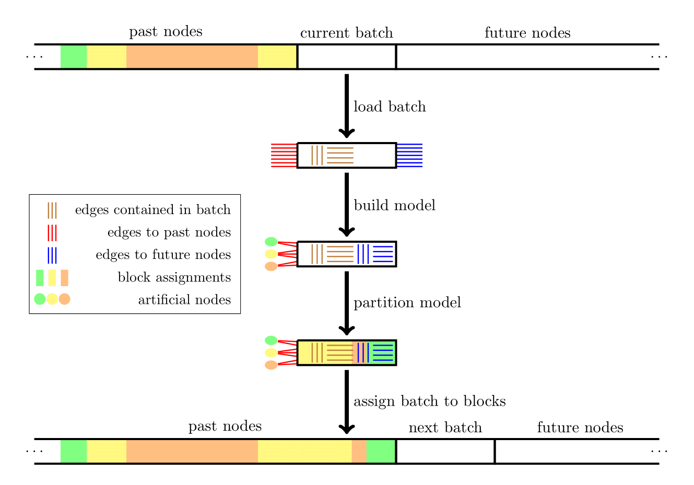
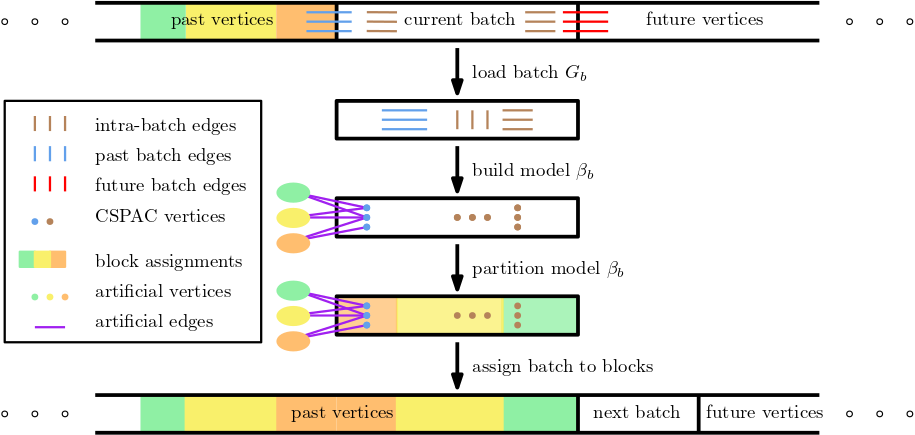

HeiStream 1.00
[](https://opensource.org/licenses/MIT)
[](https://app.codacy.com/gh/KaHIP/HeiStream/dashboard)
[](https://isocpp.org/)
[](https://cmake.org/)
[](https://github.com/KaHIP/HeiStream)
[](https://github.com/KaHIP/HeiStream)
[](https://github.com/KaHIP/HeiStream/stargazers)
[](https://github.com/KaHIP/HeiStream/issues)
[](https://github.com/KaHIP/HeiStream/commits)
[](https://github.com/KaHIP/homebrew-kahip)
[](https://doi.org/10.1145/3546911)
[](https://doi.org/10.4230/LIPIcs.SEA.2024.5)
[](https://www.uni-heidelberg.de)
=====

<p align="center">
  
</p>

**HeiStream** is a buffered streaming algorithm for graph partitioning and edge partitioning of massive graphs using little memory, combining multilevel methods with a streaming computational model. Part of the [KaHIP](https://github.com/KaHIP) organization.

| | |
|:--|:--|
| **What it solves** | Node and edge partitioning of graphs too large for main memory |
| **Techniques** | Buffered streaming, multilevel partitioning, Fennel scoring, priority buffering (BuffCut), restreaming |
| **Interfaces** | CLI (`heistream`, `heistream_edge`) |
| **Requires** | C++17, CMake 3.10+, OpenMP |

## Quick Start

### Install via Homebrew

```bash
brew install KaHIP/kahip/heistream
```

### Or build from source

```bash
git clone --recursive https://github.com/KaHIP/HeiStream.git
cd HeiStream
./compile.sh
```

Alternatively, use the standard CMake build process:

```bash
mkdir build && cd build
cmake .. -DCMAKE_BUILD_TYPE=Release
make -j$(nproc)
```

The resulting binaries are `deploy/heistream` and `deploy/heistream_edge`.

### Run

```bash
# Node partitioning
./deploy/heistream graph.graph --k=8 --batch_size=32768

# Node partitioning with priority buffer (BuffCut)
./deploy/heistream graph.graph --k=8 --batch_size=32768 --buffer_size=65536

# Edge partitioning
./deploy/heistream_edge graph.graph --k=8 --batch_size=32768

# Full parameter list
./deploy/heistream --help
./deploy/heistream_edge --help
```

---

## Architecture

### HeiStream (Node Partitioning)

<p align="center">

</p>

HeiStream slides through the streamed graph by repeating: load a batch of nodes, build a model representing the batch and already-partitioned vertices, partition the model with a multilevel algorithm optimizing the Fennel objective, and permanently assign the batch nodes to blocks.

When priority buffering is enabled (`--buffer_size > 1`), the stream first inserts candidate nodes into a bounded priority buffer; high-priority nodes are then selected to form each batch before model construction and multilevel partitioning.

### HeiStreamE (Edge Partitioning)

<p align="center">
  
</p>

HeiStreamE extends HeiStream to edge partitioning, dividing the edges of a graph into k disjoint blocks while minimizing vertex replicas. Edges are transformed into vertices in a model graph, then partitioned using multilevel vertex partitioning.

---

## Node Partitioning Modes

| Mode | Flags | Description |
|------|-------|-------------|
| Baseline | `--buffer_size=0` (default) | Nodes processed in batches of `--batch_size` |
| Priority buffer (sequential) | `--buffer_size > 1` | BuffCut integration, priority-based batching |
| Priority buffer (parallel) | `--buffer_size > 1 --run-parallel` | Parallel priority-buffer pipeline |

Restreaming (`--num_streams_passes > 1`) is supported in all modes.

## Edge Partitioning Options

```bash
# Stream output on-the-fly (avoids O(m) overhead)
./deploy/heistream_edge graph.graph --k=8 --batch_size=32768 --stream_output_progress

# Benchmark mode (no file output)
./deploy/heistream_edge graph.graph --k=8 --batch_size=32768 --benchmark

# Custom output file
./deploy/heistream_edge graph.graph --k=8 --output_filename=partition.txt
```

Restreaming for edge partitioning is supported in `minimal_mode` only.

## Timing and Reporting

- `Total time` is always reported in the run summary.
- Fine-grained timing (`IO/Model/Postprocess/Buffer maintenance/Partition`) requires compiling with profiling: `./compile.sh ON`.
- `--evaluate=false` skips evaluator work and summary reporting.
- `--write_log` writes a FlatBuffer `.bin` log file.

---

## Notes

- Edge balancing: use `--balance_edges` to balance edges instead of nodes.
- 64-bit edge IDs are enabled by default.
- For the METIS graph format, refer to the [KaHIP manual](https://github.com/KaHIP/KaHIP/raw/master/manual/kahip.pdf).

---

## Citing

If you use HeiStream or HeiStreamE in your research, please cite:

```bibtex
@article{heistream,
    author    = {Marcelo Fonseca Faraj and Christian Schulz},
    title     = {Buffered Streaming Graph Partitioning},
    journal   = {ACM Journal of Experimental Algorithmics},
    year      = {2022},
    doi       = {10.1145/3546911},
    publisher = {Association for Computing Machinery}
}
```

```bibtex
@inproceedings{heistreamE,
    author    = {Adil Chhabra and Marcelo Fonseca Faraj and Christian Schulz and Daniel Seemaier},
    title     = {Buffered Streaming Edge Partitioning},
    booktitle = {22nd International Symposium on Experimental Algorithms (SEA 2024)},
    series    = {LIPIcs},
    volume    = {301},
    pages     = {5:1--5:21},
    year      = {2024},
    doi       = {10.4230/LIPIcs.SEA.2024.5}
}
```

## Licensing

HeiStream and HeiStreamE are distributed under the MIT License. See [LICENSE](LICENSE) for details.
